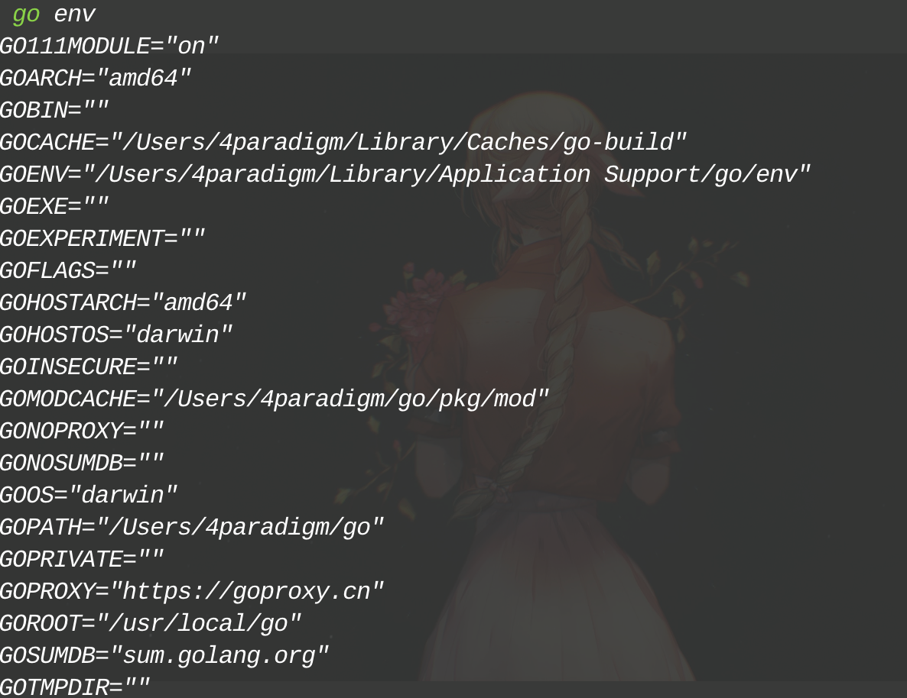

## 关于GO

这部分知识，等我研究透再加上，不扯蛋了，想知道是啥自己百度。

总之，GO语言在网络编程和后端开发等领域很有优势，因此这里特地开个文档把之前想搞的，搞过的内容扔在这里。

## 开发前准备

### 安装

[安装地址](https://golang.google.cn/dl/)

建议选用1.18版本环境，因为我想用，所以后面的教程会介绍一些至1.18为止的特性。

### 环境设置

> The go command and the tools it invokes consult environment variables for configuration. 

设置环境变量，可以减少后续开发问题，降低开发难度和成本。

Go依赖的环境变量可以使用如下命令进行查看

```bash
go env
```



其中，有几个典型的环境变量对开发有重要影响需要我们自行设置，因此我们也会围绕如何设置这几个内容展开。

#### GO111MODULE

> Controls whether the go command runs in module-aware mode or GOPATH mode.

[参考连接](https://go.dev/ref/mod#mod-commands)

到底是啥的话可以看文档，总结一下就是提供了一个可选择接口，决定GO的包运行是否依赖于`go.mod`的结果。

开启后（默认开启）`go.mod`当中的依赖包会被下载（如果缓存中存在则不下载）

#### GOPROXY

GO 提供了允许代理设置的环境变量，由于国内网络环境问题，为了加速包下载，这里介绍七牛云的代理设置。

[七牛云GO代理](https://goproxy.cn/)

```bash
go env -w GOPROXY=https://goproxy.cn,direct	
```

理论上可以搞个自托管模块，但是比较麻烦，暂时没有这么多的GO开发需求，之后有时间慢慢加。

### 包管理

> 在 `GO1.11` 版本后，GO语言引入了Module模块用来管理所需包，因此这里先介绍如何使用 `go.mod`文件有效管理包。

GO的环境管理依托于`go.mod`对于每一个独立包来说，都有属于自己`go.mod`，在允许机器读写的同时又可以认为设置环境。

[官方文档参考链接](https://github.com/golang/go/wiki/Modules)

#### 创建文件流程

使用GOMOD可以创建并管理新的module，具体操作如下：

##### 创建github仓库（可选）

GITHUB用来生成并管理GO项目十分有效，因此在开发GO项目前可以选择先建一个github仓库，并将这部分内容存储在里面。

1. Github上创建仓库
2. 本地创建文件夹`git init`
3. 绑定远程仓库和本地`git remote add origin https://github.com/username/repo.git`


